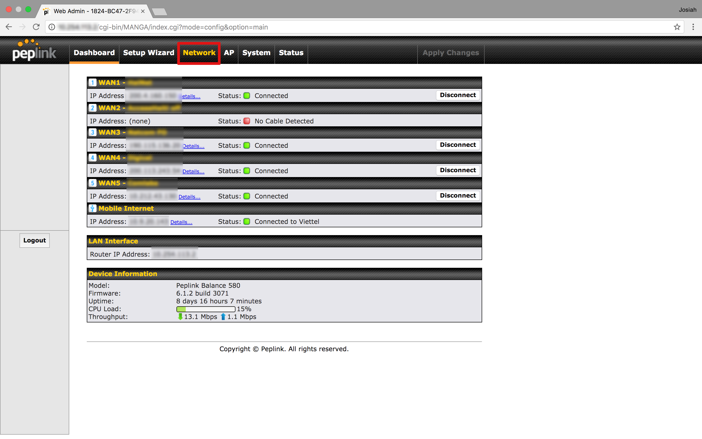
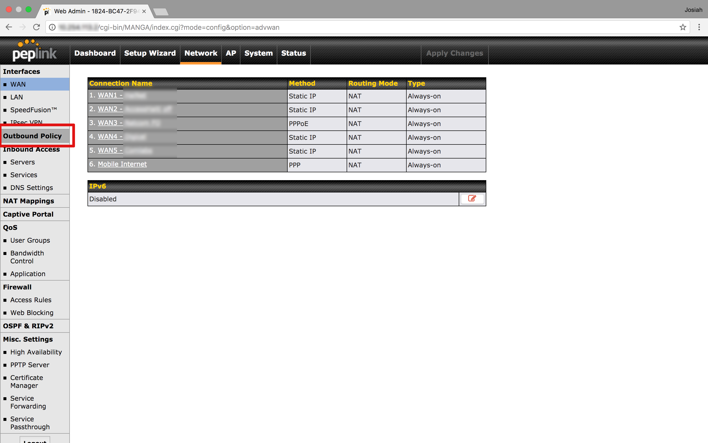
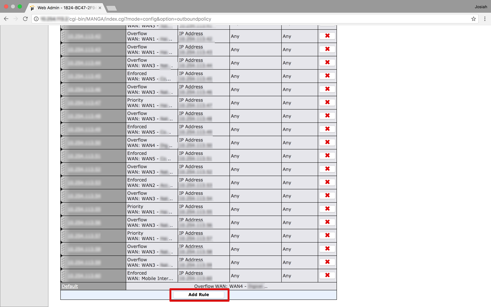
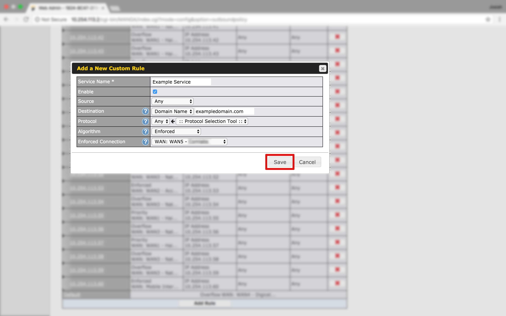
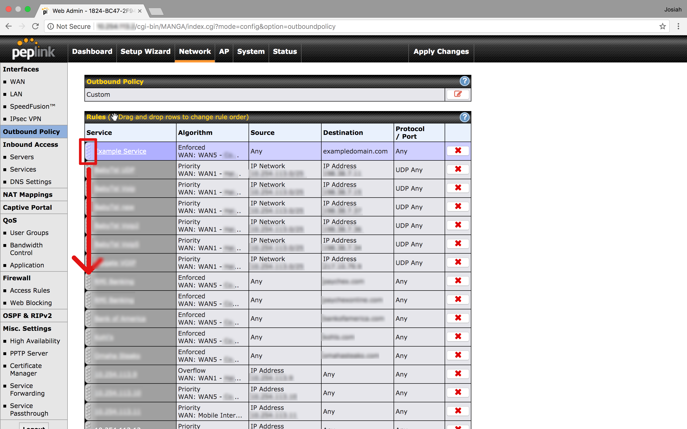
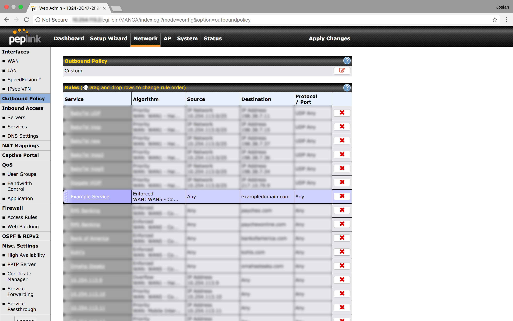
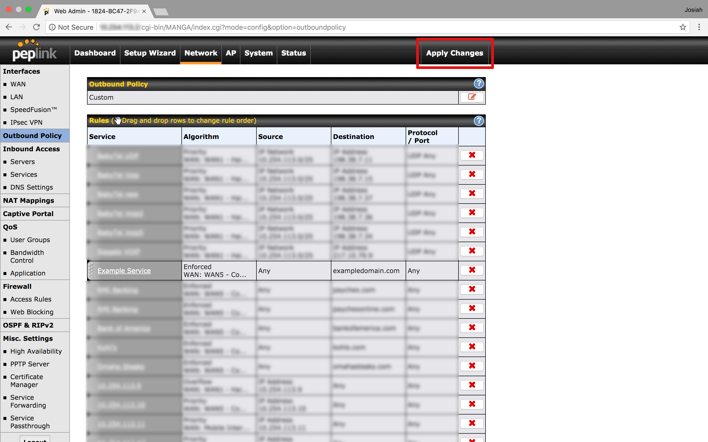

There are several instances where one may want to route traffic to a specific
domain through a certain WAN connection. One use case I recently encountered is
when your country's IP is blocked for a specific site. It's a relatively simple
process, and can be a really powerful tool when managing a network. Here's the
steps:

Firstly, we'll open up the network preferences  

 Then, navigate to the outbound policy page. When
outbound policy is set to custom, this page will list any specific
traffic-routing rules you have set up. If it is not set to custom, go ahead and
set it now.
  

Scroll the whole way to the bottom of the list, then add a new rule

Go ahead and name the rule something recognizable so you will know what it is for in the future. To filter by domain, Adjust the "Destination" section accordingly, then enter your domain name. Wildcards are also supported. for more information, click the `?` button. Choose an appropriate algorithm for routing your traffic. Typically, enforced will be the most applicable, but [other options](https://www.peplink.com/technology/load-balancing-algorithms/) are available. 

When you are finished with the configuration, save your changes.

Your now rule will be placed at the top of the list. The filters will be applied from the top down, so if you want other rules to be higher-priority (for VoIP maybe?), drag your new rule down below them. 

Now, click the apply changes button to finalize your changes. The traffic to your specified domain should now be using the algorithm you configured. Go ahead and and give it a test!
